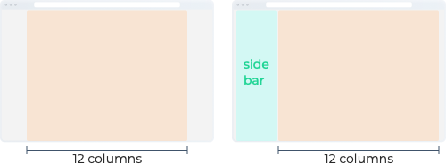

# Grid & Layout

## Grids

#### • Product UI

| Type | Screen width \(px\) | Sidebar width \(px\) | Container width \(px\) |
| :--- | :--- | :--- | :--- |
| Small | 1440 | None | 1280 |
| Medium | 1680 | None | 1520 |
| Large | 1920 | None | 1760 |
| Small | 1440 | 220 | 1180 |
| Medium | 1680 | 220 | 1420 |
| Large | 1920 | 220 | 1660 |

#### • Landing Pages

| Type | Screen width \(px\) | Sidebar width \(px\) | Container width \(px\) |
| :--- | :--- | :--- | :--- |
| Small | 1440 | None | 1080 |
| Medium | 1680 | None | 1380 |
| Large | 1920 | None | 1620 |

## Layouts

#### • Landing Pages \(Full\)

#### • Dashboard Pages \(1:3\)

#### • Live View Pages \(2:1\)

#### • Special Forms \(1:1\)

#### • Enroll Pages \(Full\)

## Spacing

#### • Vertical Spacing

#### • Horizontal Spacing

* **Gutter**: 20px / 30px
* **Content**: 10px base

